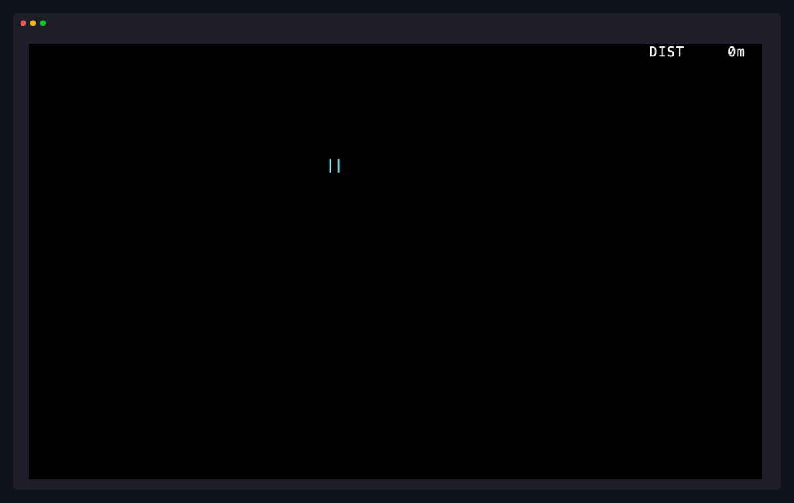

# yeti

> ski down a mountain until the yeti finds you



You ski down a mountain. Somewhere between 30 and 60 seconds in, a yeti appears and starts closing the distance. You can lean left or right to dodge trees, but every press also costs you a sliver of headstart against the yeti. Either the trees get you or the yeti does.

## Build & Install

```sh
make
make install
```

One C file (`src/yeti.c`, about 10 KiB). Needs a C99 compiler and ncurses; `pkg-config` is used to find ncurses if present, with an `-lncurses` fallback.

By default, it installs the binary to `/usr/local/bin`. You can customize the location using the `PREFIX` and `DESTDIR` variables:

```sh
make install PREFIX=/usr/bin DESTDIR=/tmp/pkg
```

To uninstall:

```sh
make uninstall
```

## Run

```sh
./yeti
```

Or just `yeti` if installed in your path.

## Controls

| Key | Action |
| --- | --- |
| Left / Right | lean |
| Q, ESC | quit |
| R | restart from death |

## License

Dual-licensed: MIT or CC0-1.0, your pick. See `LICENSES/MIT.txt` and `LICENSES/CC0-1.0.txt`.
